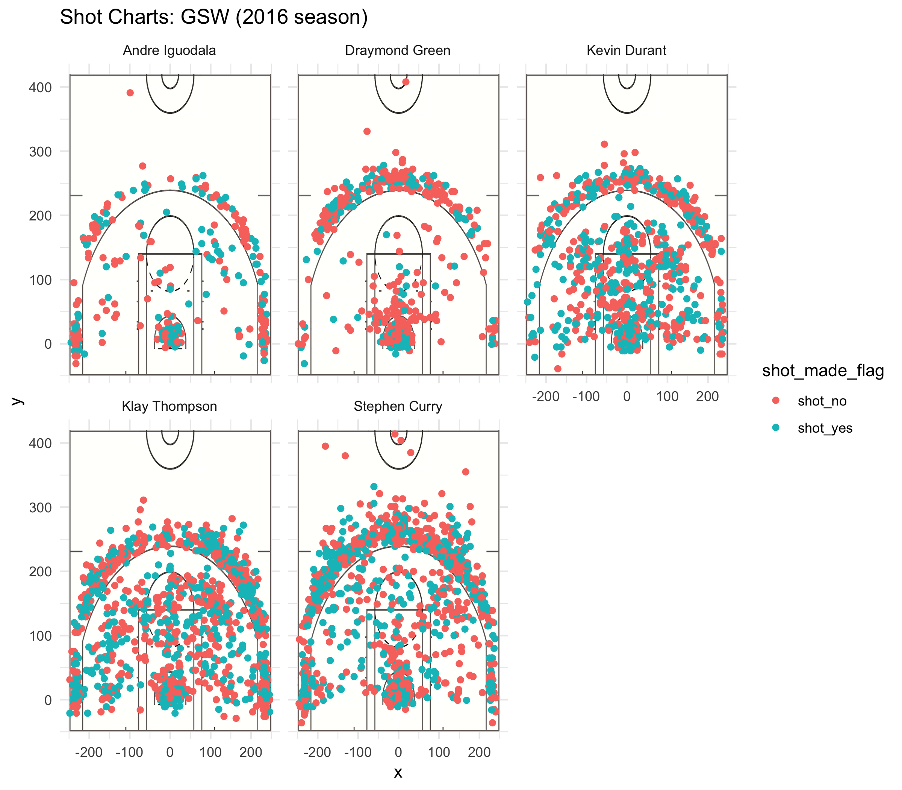

```{r}
library(dplyr)
```

###5.1) Effective Shooting Percentage
```{r}
shots_data <- read.csv('../data/shots-data.csv', stringsAsFactors = FALSE)

##make the rows
iguodala <- filter(shots_data, name == 'Andre Iguodala')
green <- filter(shots_data, name == 'Draymond Green')
curry <- filter(shots_data, name == 'Stephen Curry')
durant <- filter(shots_data, name == 'Kevin Durant')
thompson <- filter(shots_data, name == 'Klay Thompson')

```

######2PT Effective Shooting % by Player
```{r}
#iguodala 2PT
iguodala_2pt <- filter(iguodala, shot_type == '2PT Field Goal')
total_iguodala_2pt <- length(iguodala_2pt$shot_made_flag)
made_shots_iguodala_2pt <- length(filter(iguodala_2pt, shot_made_flag == 'shot_yes')$shot_made_flag)
perc_made_iguodala_2pt <- made_shots_iguodala_2pt/total_iguodala_2pt
shots_data_iguodala_2pt <- c('Andre Iguodala', total_iguodala_2pt, made_shots_iguodala_2pt, perc_made_iguodala_2pt)

#green 2PT
green_2pt <- filter(green, shot_type == '2PT Field Goal')
total_green_2pt <- length(green_2pt$shot_made_flag)
made_shots_green_2pt <- length(filter(green_2pt, shot_made_flag == 'shot_yes')$shot_made_flag)
perc_made_green_2pt <- made_shots_green_2pt/total_green_2pt
shots_data_green_2pt <- c('Draymond Green', total_green_2pt, made_shots_green_2pt, perc_made_green_2pt)

#curry 2PT
curry_2pt <- filter(curry, shot_type == '2PT Field Goal')
total_curry_2pt <- length(curry_2pt$shot_made_flag)
made_shots_curry_2pt <- length(filter(curry_2pt, shot_made_flag == 'shot_yes')$shot_made_flag)
perc_made_curry_2pt <- made_shots_curry_2pt/total_curry_2pt
shots_data_curry_2pt <- c('Stephen Curry', total_curry_2pt, made_shots_curry_2pt, perc_made_curry_2pt)

#durant 2PT
durant_2pt <- filter(durant, shot_type == '2PT Field Goal')
total_durant_2pt <- length(durant_2pt$shot_made_flag)
made_shots_durant_2pt <- length(filter(durant_2pt, shot_made_flag == 'shot_yes')$shot_made_flag)
perc_made_durant_2pt <- made_shots_durant_2pt/total_durant_2pt
shots_data_durant_2pt <- c('Kevin Durant', total_durant_2pt, made_shots_durant_2pt, perc_made_durant_2pt)

#thompson 2PT
thompson_2pt <- filter(thompson, shot_type == '2PT Field Goal')
total_thompson_2pt <- length(thompson_2pt$shot_made_flag)
made_shots_thompson_2pt <- length(filter(thompson_2pt, shot_made_flag == 'shot_yes')$shot_made_flag)
perc_made_thompson_2pt <- made_shots_thompson_2pt/total_thompson_2pt
shots_data_thompson_2pt <- c('Klay Thompson', total_thompson_2pt, made_shots_thompson_2pt, perc_made_thompson_2pt)

##create the 2PT table
name_2pt <- c(shots_data_iguodala_2pt[1], shots_data_green_2pt[1], shots_data_durant_2pt[1], shots_data_thompson_2pt[1], shots_data_curry_2pt[1])

total_2pt <- c(shots_data_iguodala_2pt[2], shots_data_green_2pt[2], shots_data_durant_2pt[2], shots_data_thompson_2pt[2], shots_data_curry_2pt[2])

made_shots_2pt <- c(shots_data_iguodala_2pt[3], shots_data_green_2pt[3], shots_data_durant_2pt[3], shots_data_thompson_2pt[3], shots_data_curry_2pt[3])

perc_made_2pt <- c(shots_data_iguodala_2pt[4], shots_data_green_2pt[4], shots_data_durant_2pt[4], shots_data_thompson_2pt[4], shots_data_curry_2pt[4])

effective_shooting_2pt <- data.frame('name' = name_2pt, 'total' = total_2pt, 'made' = made_shots_2pt, 'perc_made' = perc_made_2pt)

effective_shooting_2pt_by_percentage <- arrange(effective_shooting_2pt, desc(perc_made))
```

######3PT Effective Shooting % by Player
```{r}
#iguodala 3PT
iguodala_3pt <- filter(iguodala, shot_type == '3PT Field Goal')
total_iguodala_3pt <- length(iguodala_3pt$shot_made_flag)
made_shots_iguodala_3pt <- length(filter(iguodala_3pt, shot_made_flag == 'shot_yes')$shot_made_flag)
perc_made_iguodala_3pt <- made_shots_iguodala_3pt/total_iguodala_3pt
shots_data_iguodala_3pt <- c('Andre Iguodala', total_iguodala_3pt, made_shots_iguodala_3pt, perc_made_iguodala_3pt)

#green 3PT
green_3pt <- filter(green, shot_type == '3PT Field Goal')
total_green_3pt <- length(green_3pt$shot_made_flag)
made_shots_green_3pt <- length(filter(green_3pt, shot_made_flag == 'shot_yes')$shot_made_flag)
perc_made_green_3pt <- made_shots_green_3pt/total_green_3pt
shots_data_green_3pt <- c('Draymond Green', total_green_3pt, made_shots_green_3pt, perc_made_green_3pt)

#curry 3PT
curry_3pt <- filter(curry, shot_type == '3PT Field Goal')
total_curry_3pt <- length(curry_3pt$shot_made_flag)
made_shots_curry_3pt <- length(filter(curry_3pt, shot_made_flag == 'shot_yes')$shot_made_flag)
perc_made_curry_3pt <- made_shots_curry_3pt/total_curry_3pt
shots_data_curry_3pt <- c('Stephen Curry', total_curry_3pt, made_shots_curry_3pt, perc_made_curry_3pt)

#durant 3PT
durant_3pt <- filter(durant, shot_type == '3PT Field Goal')
total_durant_3pt <- length(durant_3pt$shot_made_flag)
made_shots_durant_3pt <- length(filter(durant_3pt, shot_made_flag == 'shot_yes')$shot_made_flag)
perc_made_durant_3pt <- made_shots_durant_3pt/total_durant_3pt
shots_data_durant_3pt <- c('Kevin Durant', total_durant_3pt, made_shots_durant_3pt, perc_made_durant_3pt)

#thompson 3PT
thompson_3pt <- filter(thompson, shot_type == '3PT Field Goal')
total_thompson_3pt <- length(thompson_3pt$shot_made_flag)
made_shots_thompson_3pt <- length(filter(thompson_3pt, shot_made_flag == 'shot_yes')$shot_made_flag)
perc_made_thompson_3pt <- made_shots_thompson_3pt/total_thompson_3pt
shots_data_thompson_3pt <- c('Klay Thompson', total_thompson_3pt, made_shots_thompson_3pt, perc_made_thompson_3pt)

##create the 3PT table
name_3pt <- c(shots_data_iguodala_3pt[1], shots_data_green_3pt[1], shots_data_durant_3pt[1], shots_data_thompson_3pt[1], shots_data_curry_3pt[1])

total_3pt <- c(shots_data_iguodala_3pt[2], shots_data_green_3pt[2], shots_data_durant_3pt[2], shots_data_thompson_3pt[2], shots_data_curry_3pt[2])

made_shots_3pt <- c(shots_data_iguodala_3pt[3], shots_data_green_3pt[3], shots_data_durant_3pt[3], shots_data_thompson_3pt[3], shots_data_curry_3pt[3])

perc_made_3pt <- c(shots_data_iguodala_3pt[4], shots_data_green_3pt[4], shots_data_durant_3pt[4], shots_data_thompson_3pt[4], shots_data_curry_3pt[4])

effective_shooting_3pt <- data.frame('name' = name_3pt, 'total' = total_3pt, 'made' = made_shots_3pt, 'perc_made' = perc_made_3pt)

effective_shooting_3pt_by_percentage <- arrange(effective_shooting_3pt, desc(perc_made))
```

######Overall Effective Shooting % by Player
```{r}
#iguodala overall
total_iguodala_overall <- length(iguodala$shot_made_flag)
made_shots_iguodala_overall <- length(filter(iguodala, shot_made_flag == 'shot_yes')$shot_made_flag)
perc_made_iguodala_overall <- made_shots_iguodala_overall/total_iguodala_overall
shots_data_iguodala_overall <- c('Andre Iguodala', total_iguodala_overall, made_shots_iguodala_overall, perc_made_iguodala_overall)

#green overall
total_green_overall <- length(green$shot_made_flag)
made_shots_green_overall <- length(filter(green, shot_made_flag == 'shot_yes')$shot_made_flag)
perc_made_green_overall <- made_shots_green_overall/total_green_overall
shots_data_green_overall <- c('Draymond Green', total_green_overall, made_shots_green_overall, perc_made_green_overall)

#curry overall
total_curry_overall <- length(curry$shot_made_flag)
made_shots_curry_overall <- length(filter(curry, shot_made_flag == 'shot_yes')$shot_made_flag)
perc_made_curry_overall <- made_shots_curry_overall/total_curry_overall
shots_data_curry_overall <- c('Stephen Curry', total_curry_overall, made_shots_curry_overall, perc_made_curry_overall)

#durant overall
total_durant_overall <- length(durant$shot_made_flag)
made_shots_durant_overall <- length(filter(durant, shot_made_flag == 'shot_yes')$shot_made_flag)
perc_made_durant_overall <- made_shots_durant_overall/total_durant_overall
shots_data_durant_overall <- c('Kevin Durant', total_durant_overall, made_shots_durant_overall, perc_made_durant_overall)

#thompson overall
total_thompson_overall <- length(thompson$shot_made_flag)
made_shots_thompson_overall <- length(filter(thompson, shot_made_flag == 'shot_yes')$shot_made_flag)
perc_made_thompson_overall <- made_shots_thompson_overall/total_thompson_overall
shots_data_thompson_overall <- c('Klay Thompson', total_thompson_overall, made_shots_thompson_overall, perc_made_thompson_overall)

##create the overall table
name <- c(shots_data_iguodala_overall[1], shots_data_green_overall[1], shots_data_durant_overall[1], shots_data_thompson_overall[1], shots_data_curry_overall[1])

total <- c(shots_data_iguodala_overall[2], shots_data_green_overall[2], shots_data_durant_overall[2], shots_data_thompson_overall[2], shots_data_curry_overall[2])

made_shots <- c(shots_data_iguodala_overall[3], shots_data_green_overall[3], shots_data_durant_overall[3], shots_data_thompson_overall[3], shots_data_curry_overall[3])

perc_made <- c(shots_data_iguodala_overall[4], shots_data_green_overall[4], shots_data_durant_overall[4], shots_data_thompson_overall[4], shots_data_curry_overall[4])

effective_shooting_overall <- data.frame('name' = name, 'total' = total, 'made' = made_shots, 'perc_made' = perc_made)

effective_shooting_overall_by_percentage <- arrange(effective_shooting_overall, desc(perc_made))
```

###5.2) Narrative 

  The Golden State Warriors are one of the most well known teams in the NBA. The team has very many high ranking players that are household names throughout all of America. In this report, I used the skills I learned so far in Stat 133 (data wrangling, plotting points, creating charts, etc) to make shot charts of five of the best players in the Golden State Warriors: Stephen Curry, Klay Thompson, Draymond Green, Kevin Durant, and Andre Iguodala. The purpose of this report was to work on a more complex file structure, visualize shot data of NBA players, and produce a report document.
  
  The motivation of this report is to run analyses on the five players in the Golden State Warriors team through the given data files, and the data tables and graphs we are instructed to create. I had to use the data that was given to compute shooting average percentages, as well as visualize where on the court that shots were made. 
  
  As background, there are three ways to get points in a basketball game. There are two point field goals, three point field goals, and one point field goals. The amount of points that are scored is based on where the shot was made. If it was made outside the three point (large bottom semicircle) line on the court, then the shot is worth three points, if it is made inside the three point line on the court, then the shot is worth two points. If it was made on the foul line (horizontal line inside the small circle), then it is worth one point. 
  
  I was given five datasets: one for each player. I made statistical summaries of each of the players' data and exported them to the output/ directory. Using the data from each players' datasets, I was able to create a shot chart for each player. The shot chart is a scatterplot that plots the x coordinate of the court to the y coordinate of the court, so we know which position that the shot was made from. The datasets also contained whether or not the shot was made, so I was able to color the different points on the scatterplot based on whether or not the attempted shot scored any points. I put a picture of half of the basketball court behind the scatterplot so that it was clear to see where on the court the shot was made, and whether it was a three point, two point, or one point shot. Finally, I put all the shot charts together on one facet grid so that I could compare them. When comparing the players' shot charts, it is very difficult to see which player had the best accuracy, especially since there were so many points on a small area. It is also difficult for us to visually identify which player proportionally had more made shots than missed shots because their ratio of green to red scatter points look roughly the same at first glance. To know who has the best accuracy, I had to make individual tables of the different shot point values to see which player had to highest accuracy.
  
  To do this, I also added more columns to each player's table, like a name column that contains the player's name and the minutes column that contains the minute in the game in which the field goal was scored. Then I was able to stack the dataframes that I made for each player with the new columns together into one large dataframe that contained everyone's data, and I could tell which rows corresponded to which player based on the value in the name column. In the large dataset, I was able to create tables to rank the players based on their shooting accuracy. I filtered out the large dataset to get the values that I needed and made smaller dataframes that had the players' names, their total attempted shots for each point value and overall, their made shots, and their accuracy percentage. I was able to arrange the table based on the percentages, with the highest percentage of made shots on the top and the lowest on the bottom. I noticed that there was no one player that had the highest percentage of shots made in all three categories of two point field goals, three point field goals, and overall. Instead, each category had a different highest accuracy player. The highest two point accuracy player is Andre Iguodala. The highest three point accuracy player is Klay Thompson. And the highest overall accuracy player is Kevin Durant. This data shows that just because one player is very good at a certain kind of shot, they are not necessarily the overall best shooter, and the best overall shooter may not score the highest proportion of one point and two point shots.  
  
  Here is the shot chart that I created from the data:
```{r out.width = '80%', echo = FALSE, fig.align = 'center'}
##picture of the shot chart

```

  Here are the data tables that I created:
Each table is a summary of each player's shooting accuracy for each field goal point value. The 'name' column is a column containing all the players' names. The 'total' column is a column containing the number of all the shots in that field goal's point value that the player attempted to make. The 'made' column is a column containing the number of all the shots in that field goal's point value that the player actually made. The perc_made column is a column with the proportion of made shots divided by the number of total shots attempted. I sorted the table based on highest perc_made, which means that the first name in the table is the player with the highest percentage of made shots, and the last name in the table is the player with the lowest percentage of made shots.
```{r}
effective_shooting_2pt_by_percentage
effective_shooting_3pt_by_percentage
effective_shooting_overall_by_percentage
```

  The take home message of this report is that oftentimes it is difficult to visually compare different datasets, especially when their values are similar. In this report specifically, it is very difficult to see which player has the best accuracy, since their percent of made shots are very close together and it is difficult to distinguish that visually, especially with many points in a small area. You can verify that by looking at the shot chart I created and seeing how similar in value the perc_made column in the data tables are. On a more basic level, this report taught me the importance of an organized file structure. It is a lot easier for others to read and interpret my data if I organize it nicely. I also know where every piece of my project is and won't have to go through a long, chaotic list of ambiguous file names to find what I want. I also learned that it is important to have a report to provide a narrative as to what the data means so that others can understand my data better.


